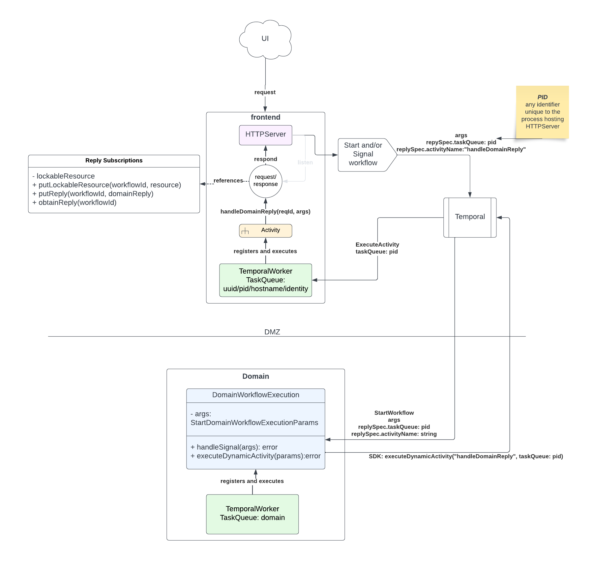

# request/reply

This pattern demonstrates how to obtain replies from a Workflow for a user experience to continue while the Workflow
makes progress in the background. 
Consider this pattern if you need to perform some initial steps in your Workflow and reply with their results to the caller, but need
to continue making progress to completion.

This pattern works by having a Temporal SDK Worker inside the _caller_ process, registering Activity code that can
access a shared resource, such as a channel or CountDownLatch, which is owned by the initiator of the Workflow.

## Example Details

This example demonstrates a typical Web application that needs to Start a workflow, receive back some initial validation by the 
underlying Domain Workflow, then unblock the request so that the user may move to the next interaction.

### Running This Example

#### `frontend` module

This is the Web application. 

##### API Controller
It exposes a single endpoint at `POST /workflows`.
Input params can be:
- `workflowId` (string): the workflow id to use (required)
- `replyTimeoutSecs` (long): if specified, this will simulate timing out for the reply
- `simulateValidationFailure` (boolean): if specified, reply with a validation failure and return a `400` status code

This process hosts a Temporal Worker at TaskQueue `replies-{APP_UUID}` and registers the [ReplyActivities](frontend/src/main/java/io/temporal/applied/patterns/requestreply/frontend/channels/ReplyActivities.java).
This activity will "unlock" the shared resource using the the [Replies](frontend/src/main/java/io/temporal/applied/patterns/requestreply/frontend/channels/Replies.java) implementation
that holds the `CountDownLatch` reference.

When a `DomainWorkflow` is `start`ed, a `ReplySpec` is passed down to tell the Workflow how to "reply" by executing a dynamic activity.

This spec has the following properties:
- `taskQueue`: The task queue solely associated with the Web application process so that the in-memory resource owned by the `/workflows` endpoint can be interacted with.
- `activityName`: The activityName the Web application designates should be called as a "reply" by the Workflow.

